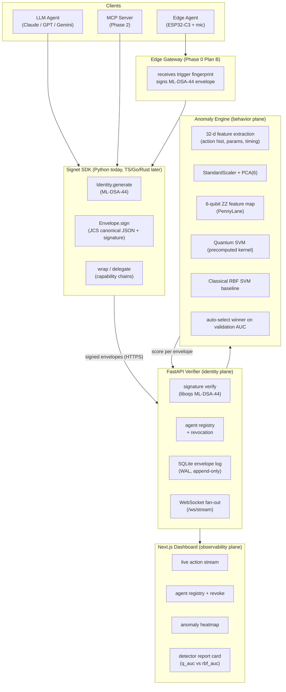

# Signet Architecture

Three planes, one spine.

## Identity plane

- **SDK** holds the ML-DSA-44 secret key and produces canonical, signed
  envelopes. JCS-shaped canonicalisation (`json.dumps(sort_keys=True,
  separators=(",", ":"))` for Phase 0; RFC 8785-strict in Phase 1).
- **Verifier** stores the public key on registration and checks every
  submission with `oqs.Signature("ML-DSA-44").verify(payload, sig, pubkey)`.
- **Revocation** is a single boolean column in the SQLite agents table for
  Phase 0; the in-memory cache flips immediately and is broadcast on the
  WebSocket. Phase 1 swaps in a Sparse Merkle Tree with proof-of-non-membership.

## Behavior plane

- 32-d feature vector per sliding window of N=20 envelopes per agent.
- Standard-scaled, PCA-reduced to 6 dimensions, encoded into a 6-qubit ZZ
  feature map (Havlíček 2019).
- The verifier trains both a quantum-kernel SVC (precomputed kernel from
  PennyLane's `default.qubit`) and a classical RBF SVC at boot and serves
  whichever wins on a stratified held-out split.
- A cold-start guardrail (out-of-vocabulary action ratio) is OR-ed with the
  ML score so partial windows can't sneak unknown actions past the detector.

## Observability plane

- WebSocket `/ws/stream` broadcasts every accepted envelope and every
  revocation as JSON.
- Dashboard subscribes once, keeps a 80-envelope ring buffer in memory, polls
  `/v1/agents` every 5 s for revocation state.
- All identifiers (`agt_*`, `env_*`, `prn_*`) render in monospace.
- Dark mode is the only mode.

## Edge agent (Phase 0 plan B)

- ESP32-C3 firmware (`firmware/`) does I²S audio capture and a 200 ms
  RMS-energy trigger. On trigger it POSTs `{fingerprint_sha256, rms, nonce}`
  to the **edge gateway** (`scripts/edge_gateway.py`).
- The gateway holds the device's registered ML-DSA-44 identity. It signs the
  envelope on the device's behalf and submits it to the verifier.
- On-device signing (pqm4 RISC-V port) is Phase 1; we documented but did not
  attempt it in the hackathon window per PRD §15.
