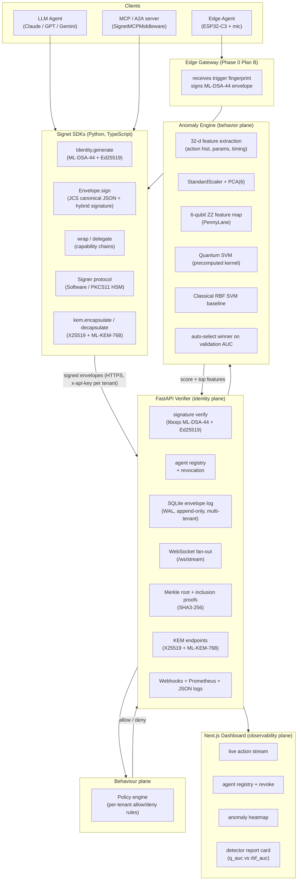

# Signet Architecture

Three planes, one spine.

## Identity plane

- **SDKs** (Python + TypeScript) hold the ML-DSA-44 secret key and produce
  canonical, signed envelopes. Canonicalisation:
  `json.dumps(sort_keys=True, separators=(",", ":"))` in Python and a
  bit-compatible recursive sort in TypeScript. Envelopes signed in TS
  verify against the Python verifier without modification.
- **HSM signer abstraction.** `signet.hsm.Signer` is a duck-typed protocol;
  the SDK ships `SoftwareSigner` (in-process liboqs) and a `PKCS11Signer`
  stub for HSM deployments.
- **Verifier** stores the public key on registration and checks every
  submission with `oqs.Signature("ML-DSA-44").verify(payload, sig, pubkey)`.
- **Revocation** is a single column in the SQLite agents table; the
  in-memory cache flips immediately and is broadcast on the WebSocket.
- **Multi-tenancy.** Every row carries a `tenant_id`. Per-tenant API keys
  via `SIGNET_API_KEYS` JSON map drive the auth middleware; cross-tenant
  envelope verify returns `reason: tenant_mismatch`.
- **Hybrid KEM.** `/v1/kem/{keygen,encapsulate,decapsulate}` uses X25519 +
  ML-KEM-768; the combined secret is `SHA3-256("signet-hybrid-kem|" ||
  x25519_ss || "|" || mlkem_ss)`.

## Behavior plane

- 32-d feature vector per sliding window of N=20 envelopes per agent.
- Standard-scaled, PCA-reduced to 6 dimensions, encoded into a 6-qubit ZZ
  feature map (Havlíček 2019).
- The verifier trains both a quantum-kernel SVC (precomputed kernel from
  PennyLane's `default.qubit`) and a classical RBF SVC at boot and serves
  whichever wins on a stratified held-out split.
- A cold-start guardrail (out-of-vocabulary action ratio) is OR-ed with the
  ML score so partial windows can't sneak unknown actions past the detector.
- **Policy engine** evaluates declarative allow/deny rules per tenant after
  the cryptographic check. First-match-wins per policy; any policy returning
  deny blocks the envelope and surfaces `policy_rule_id` in the verdict.
  Match supports glob patterns on action name, capability, params.

## Observability plane

- WebSocket `/ws/stream` broadcasts every accepted envelope and every
  revocation as JSON.
- Dashboard subscribes once, keeps an 80-envelope ring buffer in memory,
  polls `/v1/agents` every 5 s for revocation state.
- Clicking a green envelope row opens a Merkle inclusion-proof modal that
  shows root, leaf hash, leaf index, and the sibling path.
- Webhooks fire on `envelope.verified`, `envelope.rejected`, `agent.revoked`,
  `anomaly.detected` (score ≥ 0.7). HMAC-SHA256 signature in
  `X-Signet-Signature`, tenant-scoped.
- Prometheus exposition at `/metrics`. Structured JSON logs to stdout
  (level via `SIGNET_LOG_LEVEL`).
- All identifiers (`agt_*`, `env_*`, `prn_*`) render in monospace.
- Dark mode is the only mode.

## Edge agent (Phase 0 plan B)

- ESP32-C3 firmware (`firmware/`) does I²S audio capture and a 200 ms
  RMS-energy trigger. On trigger it POSTs `{fingerprint_sha256, rms, nonce}`
  to the **edge gateway** (`scripts/edge_gateway.py`).
- The gateway holds the device's registered ML-DSA-44 identity. It signs the
  envelope on the device's behalf and submits it to the verifier.
- On-device signing (pqm4 RISC-V port) is Phase 2; documented but not yet
  attempted.
