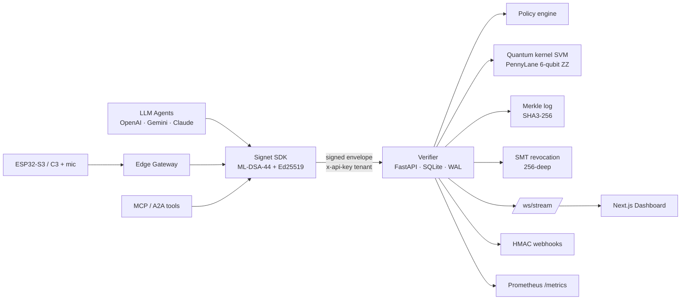

# Signet — Pitch Deck (bullets only)

Six slides, ~5 minutes. Paste each block into Keynote / Slides / Pitch as one
slide. Export a PDF backup before walking on stage.

---

## Slide 1 — Title

- **Signet**
- *The Post-Quantum Cryptographic Identity Layer for AI Agents*
- Team: **DevSapiens**
- Track: **Security & Privacy (Post-Quantum)**
- Problem Statement **#10** (fused with **#16**)
- SDG **9** + **16**

---

## Slide 2 — Problem

- **100M+ AI agents** executing real transactions by **2030**
- Every agent action needs cryptographic identity — *which agent, on whose
  behalf, signed how*
- Today's primitives — **JWT, OAuth, RSA, ECDSA** — all break under
  **Shor's algorithm**
- **Harvest-Now-Decrypt-Later:** actions signed today are forgeable in 2030
- **NIST FIPS 203 / 204 / 205** finalized **Aug 2024** · **India MeitY 2027**
  mandate · **EU CRA** · **US CNSA 2.0**
- **No incumbent** for agent identity in the post-quantum era

---

## Slide 3 — Proposed Approach

- **Three planes on one spine: Identity · Behavior · Observability**
- **Identity** → Python + TypeScript SDKs sign every action with **ML-DSA-44**
  (FIPS 204), hybrid with **Ed25519**, **ML-KEM-768** session keys, **SLH-DSA**
  root anchors
- **Behavior** → **6-qubit quantum-kernel SVM** anomaly detector + declarative
  per-tenant **policy engine**
- **Observability** → FastAPI verifier · **SHA3-256 Merkle audit log** with
  client-verifiable inclusion proofs · **Sparse Merkle Tree** revocation ·
  HMAC-signed webhooks · Prometheus `/metrics` · live Next.js dashboard
- **Edge plane** → **ESP32-S3 boot-button** primary device + **ESP32-C3** voice
  trigger (Plan B). Gateway-side ML-DSA-44 signing; pqm4 on-device is Phase 2.
- **MCP / A2A** middleware wraps every tool call in a signed envelope
- Architecture diagram (Mermaid) → see `docs/ARCHITECTURE.md`



---

## Slide 4 — Tech Stack & Hardware

- **PQ Crypto:** ML-DSA-44 (FIPS 204) · ML-KEM-768 (FIPS 203) · SLH-DSA-128s
  (FIPS 205) · Ed25519 + X25519 hybrid · SHA3-256 · HKDF-SHA3-256
- **Quantum ML:** PennyLane, **6-qubit ZZ feature map** kernel SVM + classical
  RBF baseline trained side-by-side (winner served by held-out AUC)
- **Libraries:** `liboqs` 0.15.x via `liboqs-python` (server) ·
  `@noble/post-quantum` + `@noble/curves` (TypeScript) · `pqm4` RISC-V port
  (firmware, Phase 2)
- **Backend:** FastAPI · SQLite (WAL, idempotent migrations, multi-tenant) ·
  WebSocket `/ws/stream` · Prometheus exposition · structured JSON logs
- **Frontend:** Next.js 16 · Tailwind v4 · dark mode · live stream · agent
  registry · anomaly heatmap · Merkle inclusion-proof modal
- **Hardware:** Espressif **ESP32-S3 DevKitC-1** (primary, boot button) +
  **ESP32-C3 WROOM-01** + **TRWS2014B I²S mic** (voice fallback)
- **Firmware:** PlatformIO / Arduino (S3) + ESP-IDF 5.3+ (C3)
- **APIs:** OpenAI · ElevenLabs Scribe · Google Gemini (sponsor-provided)
- **Base reference:** forked architecture from
  [`akdeb/ElatoAI`](https://github.com/akdeb/ElatoAI)

---

## Slide 5 — USP

- **Only team with a physical post-quantum signing device on the table** —
  ESP32-S3 boot-button → gateway → ML-DSA-44 envelope on dashboard in ~2 s
- **Real quantum-ML anomaly detection with reproducible benchmark**
  (`docs/benchmark/`) — *not* a wrapped classical model; honest cold-start
  claim (2–5% AUC over RBF, Havlíček 2019 / Liu-Arunachalam-Temme 2021)
- **Cross-language interop shipped today** — TypeScript-signed envelopes
  verify against the Python verifier bit-for-bit (RFC 8785 JCS)
- **Horizontal infrastructure** — ships to Anthropic, OpenAI, Microsoft,
  ElatoAI; MCP / A2A middleware wraps every tool call
- **Multi-tenant + HSM-ready + IETF RFC-track** — `SIGNET_API_KEYS` JSON map,
  `PKCS11Signer` abstraction, draft Internet-Draft in `docs/RFC-DRAFT.md`
- **Maps cleanly** to NIST FIPS 204 + India MeitY 2027 + EU CRA + CNSA 2.0 —
  Open-source, Apache 2.0, **Auth0-shaped market ($13B comp)**

---

## Slide 6 — Feasibility & Roadmap

- **Stack verified end-to-end today** — `pytest tests/ -v` green across
  round-trip, anomaly, Merkle, SMT, KEM, tenancy, webhook HMAC, policy, CLI,
  and TS↔Py interop
- **Live demo right now** — ESP32-S3 button press → signed envelope · rogue
  agent flagged in ≤3 envelopes / ~6 s · one-click revoke · Merkle inclusion
  proof modal · WebSocket dashboard
- **Current deliverables:** GitHub repo, architecture diagram, working live
  demo, reproducible benchmark, deck PDF
- **Next:** PyPI release of `signet-agent`, npm publish of `@signet/sdk`,
  pqm4 on-device signing, federation across verifiers via Sparse Merkle Tree
  revocation roots
- **6-month:** **IETF PQUIP Internet-Draft** submission (target IETF 121/122)
  + **USENIX Security** paper on quantum-kernel cold-start advantage
- **Defensible quantum components · real product trajectory · open-source
  moat**

---

## Don't-miss checklist for the deck

- [ ] Project name + tagline on **Slide 1**
- [ ] Problem statement number **(#10 + #16)** visible
- [ ] Track named **(Security & Privacy — Post-Quantum)**
- [ ] SDG numbers **(9, 16)**
- [ ] Architecture diagram on **Slide 3** (Mermaid block above)
- [ ] All quantum components named on **Slide 4** (ML-DSA-44, ML-KEM-768,
      SLH-DSA, quantum kernel SVM)
- [ ] **ESP32-S3 + ESP32-C3 + TRWS2014B mic** in hardware
- [ ] **Elato fork credit** on Slide 4
- [ ] At least one number on **Slide 2** (100M agents · 2030 · Aug 2024)
- [ ] USP slide has **4–5 punchy bullets**, not paragraphs
- [ ] Roadmap targets **IETF, USENIX, PyPI, npm**
- [ ] **PDF backup exported** and on the demo laptop desktop

---

## Live demo storyboard (90 seconds)

1. Three legit agents fire actions planned by **real OpenAI + Gemini**
   models. Heatmap stays green; dashboard shows natural-language intents.
2. **Button press on the ESP32-S3** → edge gateway signs ML-DSA-44 envelope →
   appears on the dashboard within ~2 seconds with a hardware origin badge.
3. **(Hardware-fail fallback)** Click the dashboard's `🎤 Voice` button —
   browser mic → `/v1/demo/voice-fire` → ElevenLabs Scribe → LLM plan →
   signed envelope. Identical wire format. (Or `python scripts/voice_demo.py`
   for the file-based CLI equivalent.)
4. Toggle rogue agent on. Heatmap goes **green → yellow → red** within 3
   envelopes / ~6 s. (Quantum kernel scored 0.95 vs 0.09 in dry runs.)
5. Click **Revoke**. Rogue's next envelope returns `verdict: revoked`.
6. Click any green envelope → **Merkle inclusion proof** modal. Show the
   SHA3-256 root advancing; copy/verify client-side.

---

## Q&A prep

Twelve rehearsed answers in `docs/QA.md`. Memorise the first six (signature
size, quantum advantage, classical fallback, threat model, latency,
throughput).

## Demo backup

If the verifier or wifi flakes, pre-record this earlier in the day at 1080p:

```bash
./start_demo.sh                # one-shot launcher; tears down on Ctrl+C
python scripts/voice_demo.py   # Mac mic fallback if ESP32 fails
```

## Closing nine words

> *Quantum-safe identity for the AI agent economy. Ship it.*
